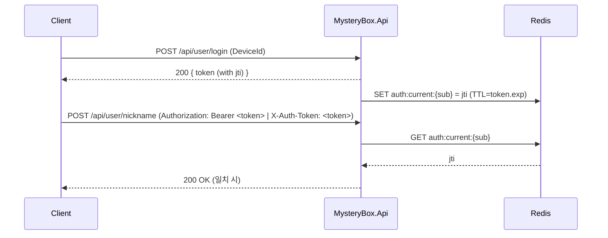

<p align="center">
  
  
  
  
  
</p>

<h1 align="center">MysteryBox API (EF Core)</h1>

<p align="center">
  EF Core + MySQL 기반 게임/유저 API. JWT(HS256) 인증과 Redis를 활용한 <b>단일 세션(JTI)</b> 검증을 지원합니다.
</p>

---

## ✨ 주요 특징

- **JWT 인증(HS256)**  
  - `iss`/`aud` 검증, **UTC** 기반 만료(`exp`), `ClockSkew=0`
  - 토큰 발급 시 `jti` 포함
- **단일 세션(싱글 로그인) 강제**  
  - 로그인 시 `auth:current:{userId}`에 최신 `jti` 저장  
  - 요청 시 헤더 토큰의 `jti`와 Redis 값을 비교하여 불일치일 경우 차단
- **헤더 유연성**  
  - 표준: `Authorization: Bearer <token>`  
  - 비표준 허용: `Authorization: <token>` 또는 `X-Auth-Token: <token>`
- **EF Core + MySQL**  
  - 깔끔한 DbContext와 엔티티 설계, 마이그레이션 지원
- **Swagger UI**  
  - Bearer & X-Auth-Token 보안 스키마 제공

---

## 🗂 프로젝트 구조

```
src/
└─ MysteryBox.Api/
   ├─ Program.cs                      # 앱 엔트리: DI, Swagger, JWT, Redis/JTI 검증, 헤더 파싱
   ├─ Data/
   │  └─ AppDbContext.cs              # EF Core DbContext (MySQL)
   ├─ Controllers/
   │  ├─ Users/
   │  │  └─ UserController.cs         # 로그인, 닉네임 등 유저 관련 API
   │  └─ Debug/
   │     └─ DebugController.cs        # (옵션) /api/diag/* 진단 엔드포인트
   ├─ Services/
   │  ├─ JwtTokenService.cs           # JWT 발급(UTC, jti 포함)
   │  ├─ RedisService.cs              # Redis 헬퍼(String/SortedSet)
   │  ├─ GeoIpService.cs              # (선택) IP 기반 국가 등
   │  ├─ ResourceLoader.cs            # (선택) 리소스 로딩
   │  └─ JwtKeyProvider.cs            # 서명키 유틸(32바이트 이상 보정)
   ├─ Common/
   │  ├─ ICurrentUser.cs              # 현재 요청의 사용자 정보 인터페이스
   │  └─ CurrentUser.cs               # JWT 클레임(sub, unique_name) → UserId/Nickname
   ├─ DTOs/
   │  └─ Requests/
   │     └─ ReqSetNickname.cs         # { "Nickname": "..." } (UserId는 받지 않음)
   └─ Models/
      └─ Game/…                       # 도메인 엔티티(Users, Items, Logs 등)
```

---

## ⚙️ 설정 (appsettings.*)

```json
{
  "ConnectionStrings": {
    "DefaultConnection": "Server=localhost;Database=mysterybox;User=root;Password=yourpassword;TreatTinyAsBoolean=false;"
  },
  "Jwt": {
    "Key": "change-me-32bytes-or-more",
    "Issuer": "MysteryBox",
    "Audience": "MysteryBoxAudience",
    "ExpiresInMinutes": 120
  },
  "Redis": {
    "ConnectionString": "localhost:6379"
  },
  "Auth": {
    "EnforceSingleSession": true
  }
}
```

> 환경변수 예시  
> `JWT__KEY`, `JWT__ISSUER`, `JWT__AUDIENCE`, `REDIS__CONNECTIONSTRING` 처럼 `__`로 중첩 키를 설정할 수 있습니다.

---

## 🧪 실행 방법 (개발)

```bash
# MySQL
docker run -d --name mysql -p 3306:3306   -e MYSQL_ROOT_PASSWORD=yourpassword mysql:8.0

# Redis
docker run -d --name redis -p 6379:6379 redis:7

# (마이그레이션을 쓰는 경우)
# dotnet ef database update -p src/MysteryBox.Api/MysteryBox.Api.csproj

# 실행
dotnet run --project src/MysteryBox.Api/MysteryBox.Api.csproj
```

> **Swagger**: 실행 후 `/swagger` 접속 → 상단 **Authorize**에서 토큰 입력

---

## 🔐 인증 흐름



---

## 🚀 빠른 사용법 (cURL)

```bash
# 1) 로그인: 토큰 발급
curl -s -X POST http://localhost:5000/api/user/login   -H "Content-Type: application/json"   -d '{"DeviceId":"dev-1"}'

# 2) 닉네임 변경 (헤더에 토큰만으로 사용자 식별)
curl -s -X POST http://localhost:5000/api/user/nickname   -H "Authorization: Bearer <TOKEN>"   -H "Content-Type: application/json"   -d '{"Nickname":"Neo"}'
```

> 헤더 유연성: `Authorization: <TOKEN>` 또는 `X-Auth-Token: <TOKEN>`도 허용되도록 구성되어 있습니다.

---

## 📚 API 요약

| Method | Path                 | Auth | Body                      | 설명 |
|------:|----------------------|:----:|---------------------------|------|
| POST  | `/api/user/login`    | ❌    | `{ "DeviceId": "dev-1" }` | 토큰 발급, Redis에 최신 `jti` 저장 |
| POST  | `/api/user/nickname` | ✅    | `{ "Nickname": "Neo" }`   | 헤더 토큰의 `sub`로 사용자 식별 |
| GET   | `/api/diag/why`      | (opt) | –                         | 토큰 파싱/JTI 비교 결과 |
| GET   | `/api/diag/claims`   | (opt) | –                         | 실제 인증 결과/실패 사유 |

---

## 📄 라이선스
프로젝트 요구에 맞게 라이선스를 추가하세요. (예: MIT)

<p align="center">
  <sub>Made with ❤️ — MysteryBox</sub>
</p>
